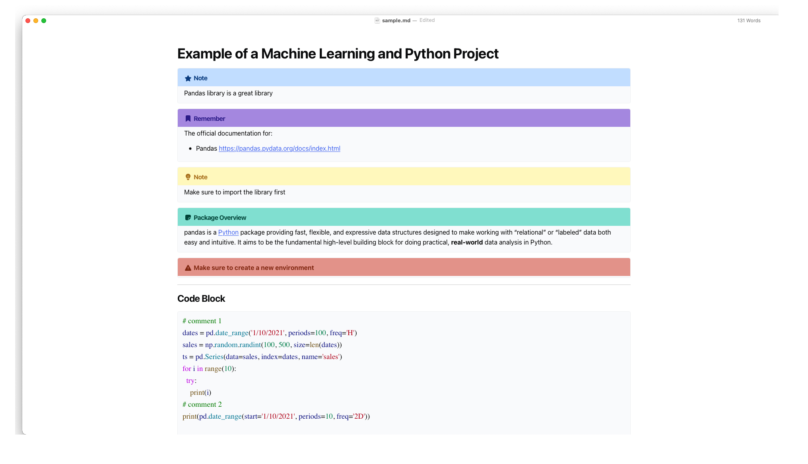

# Typora-mine-theme
Typora theme inspired by the Fluent-Typora

---

This theme is inspired and based on the [**Fluent-Typora**](https://github.com/HereIsLz/Fluent-Typora) one of the most polished and creative themes out there. Developed and created by [**Craig Li**](https://github.com/HereIsLz).

This theme has minor modifications:

* Updated the code fencing/highlight colors to be closer to the VSCode color theme. If you are a Python developer this will be close to the built-in `Light+ (VSCode)` default theme.
* Updated the bold font for code keywords and adjusted font sizes
* Added the quote block background which already existed but were not applied.
* Most of the changes were made to the [fluent.css](https://github.com/HereIsLz/Fluent-Typora/blob/main/fluent.css) file for the light theme only.

Here are screen shots

